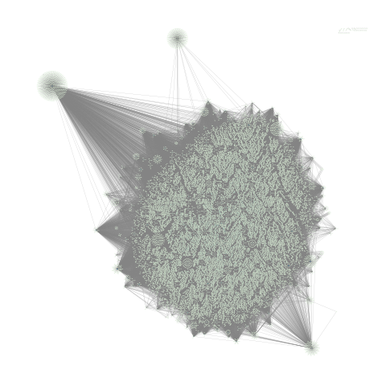

# Hyperparameter tuning using bio-inspired algorithms in GCN and GAN models for link prediction in a PPI network 

## Overview

This project is made to compare different biologically inspired algorithms like Genetic Algorithm, Particle Swarm Optimization, Ant Colony Optimization in hyperparameter tuning in Graph Convolutional Network and Generative Adversarial Network models for link prediction in a SNAPS protein-protein interaction network. 

## 🧬 Protein-Protein Interaction Network: PP-Pathways
This repository explores the <a href="https://snap.stanford.edu/biodata/datasets/10000/10000-PP-Pathways.html">PP-Pathways dataset from the Stanford SNAP BioData collection</a>. It represents a large-scale protein-protein interaction (PPI) network derived from pathway databases.

<ul>
<li>Nodes: 21,554 proteins</li>
<li>Edges: 342,338 interactions</li>
<li>Data Type: Undirected, unweighted graph</li>
<li>Source: Pathway-based protein associations</li>
<li>Format: Edge list (.csv) with each row representing a protein-protein interaction</li>
</ul>

### Graph visualization for the PPI network

This image was done using <a href="https://cytoscape.org/">Cytoscape</a>.

## Quickstart

### Prerequisites
- Python 3.8+
- [scikit-learn](https://scikit-learn.org/stable/)
- [PyTorch](https://pytorch.org/get-started/locally/) 
- [PyTorch Geometric](https://pytorch-geometric.readthedocs.io)
- [NiaPy](https://niapy.org/en/stable/index.html#niapy-s-documentation)
- [scikit-optimize](https://scikit-optimize.github.io/stable/)

### Installation
```bash
git clone https://github.com/milagjurovska/PPI-link-prediction-with-optimized-gcn-and-gan.git
cd PPI-link-prediction-with-optimized-gcn-and-gan
